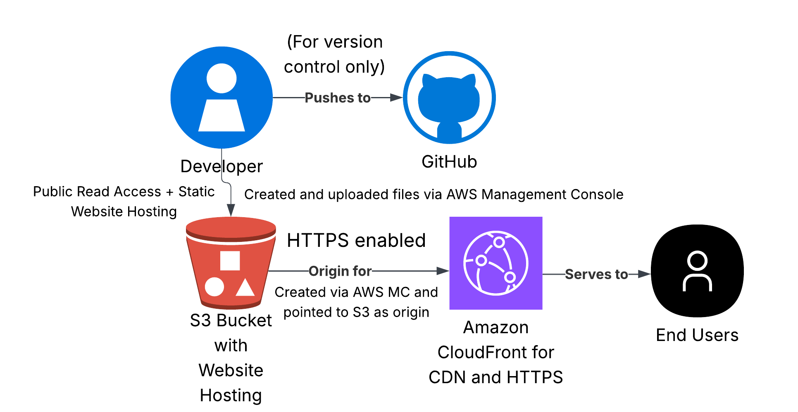
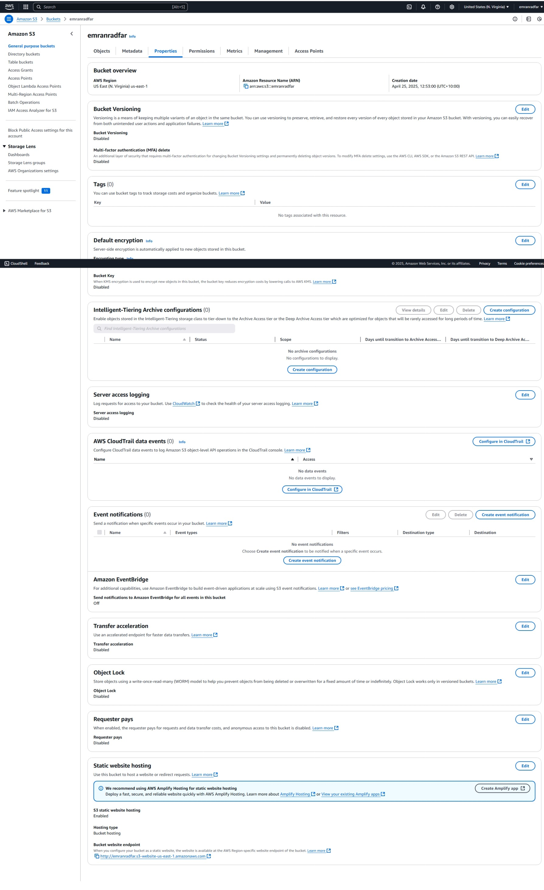
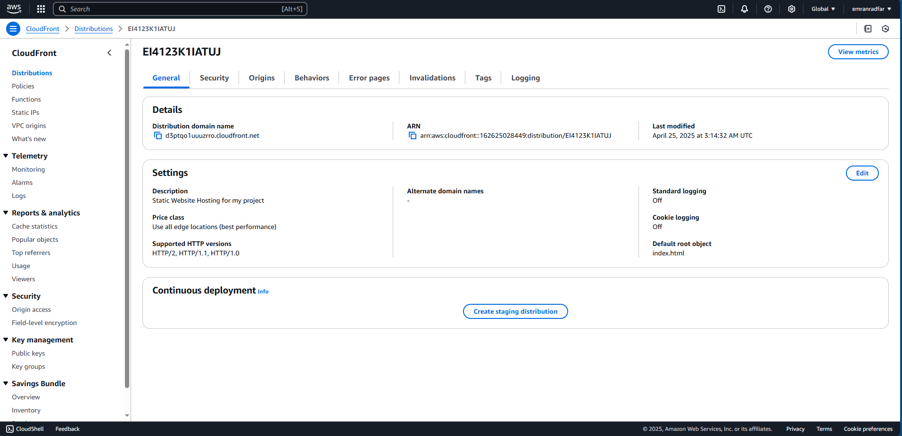
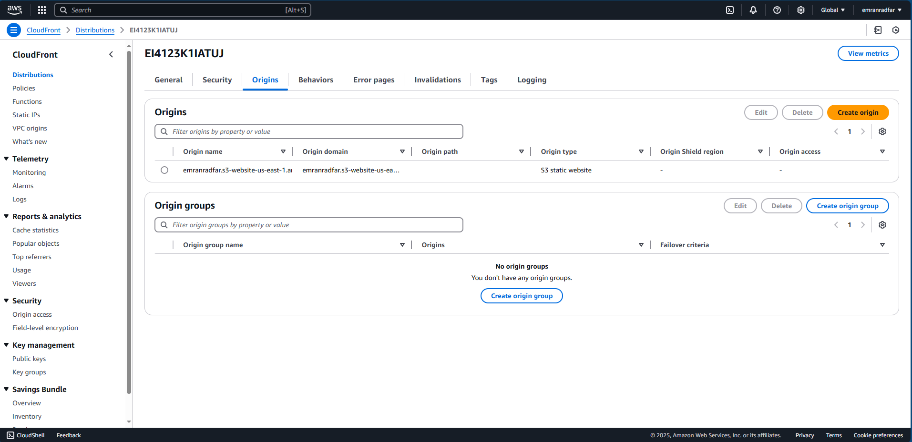
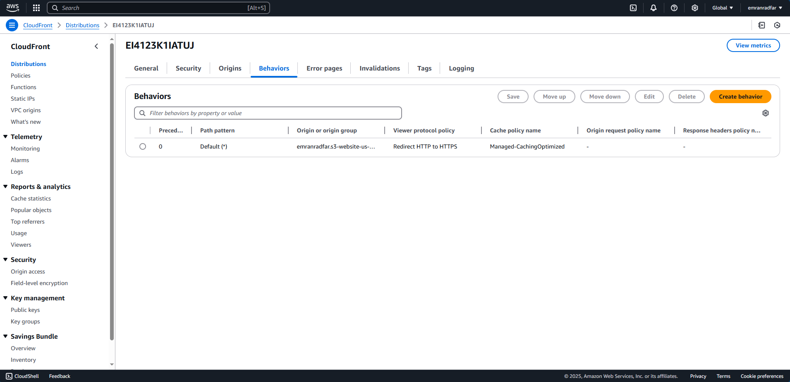
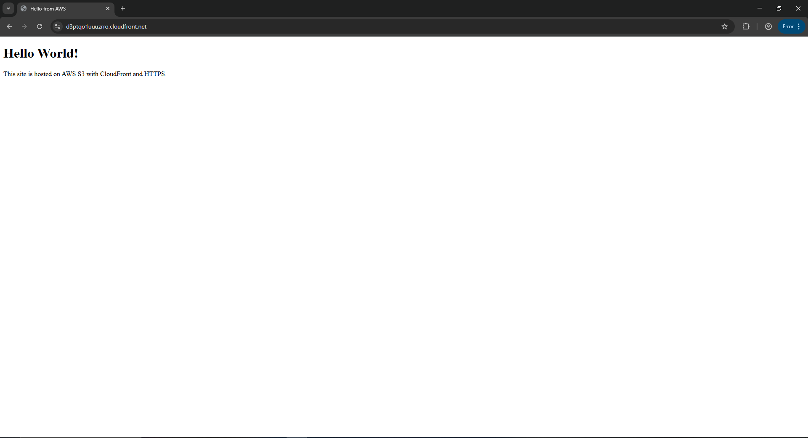

# 🌐 AWS Static Website Hosting Project

This project demonstrates how to host a simple static website on AWS using the **Free Tier**.

## ✅ What I Used

- **S3** – Static website hosting
- **CloudFront** – Content Delivery Network (CDN)

## 📁 Project Structure

- `index.html` – Basic HTML site
- `bucketpolicy.json` – S3 Bucket Policy
- `screenshots/` – S3 & CloudFront setup images
- `README.md` – Project overview

## 🚀 Live Flow

1. Created S3 bucket with public access
2. Uploaded HTML file (`index.html`)
3. Enabled static hosting in S3
4. Created CloudFront distribution (HTTPS, CDN)

## 🧠 Skills Shown

- AWS console navigation
- Static hosting best practices
- CloudFront configuration

## 📸 Screenshots

### **AWS Static Website Deployment Architecture**

This screenshot displays the architecture of the static website deployment on AWS, showcasing the integration of S3 for website hosting, CloudFront for content delivery, and the overall deployment workflow.

Stored under `/aws-static-site-screenshots` showing configurations in the AWS Console:

### **S3 Properties**

This screenshot displays the properties of the S3 bucket used for static website hosting, confirming the bucket's configuration for public access.

### **CloudFront General Settings**

This screenshot displays the CloudFront distribution general settings, demonstrating the setup of the CDN to serve the website with HTTPS and optimized caching.

### **CloudFront Origins**

This image shows the origins configured in CloudFront, pointing to the S3 bucket as the source for the static website's content.

### **CloudFront Behaviors**

This screenshot shows the cache behaviors for CloudFront, confirming the settings for how the distribution handles requests and responses.

### **Live Website**

This screenshot shows the result of the live static website hosted on AWS, demonstrating that the site is up and running.

## 📄 S3 Bucket Policy

The **`bucketpolicy.json`** file contains the required policy to grant **public read access** to the objects within the S3 bucket hosting the static website. This policy ensures that visitors can access the website's content via the CloudFront distribution (or directly via the S3 bucket if CloudFront is not used).

Ensure you use your bucket name in the Resource section.

### Here's the content of the policy:

```json
{
  "Version": "2012-10-17",
  "Statement": [{
    "Sid": "PublicReadGetObject",
    "Effect": "Allow",
    "Principal": "*",
    "Action": "s3:GetObject",
    "Resource": "arn:aws:s3:::emranradfar/*"
  }]
}

---

### Created by Emran Radfar
